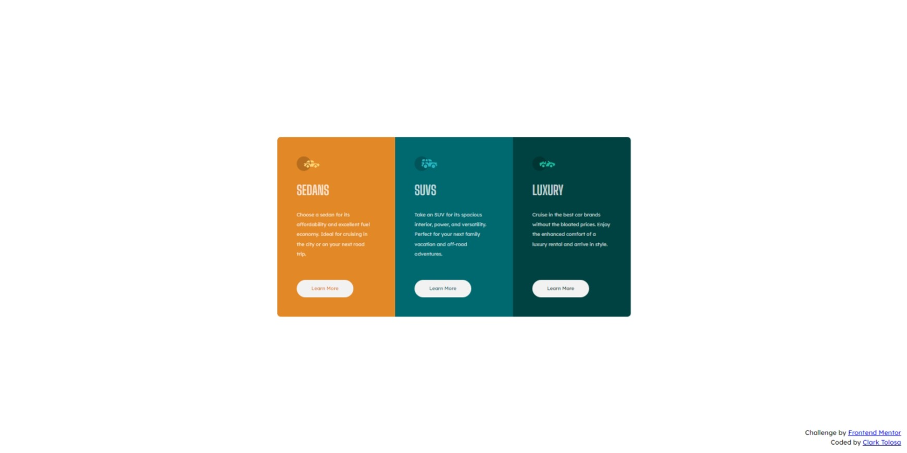

# Frontend Mentor - 3-Column Preview Card solution

This is a solution to the [3-Column Preview Card challenge on Frontend Mentor](https://www.frontendmentor.io/challenges/3column-preview-card-component-pH92eAR2-). Frontend Mentor challenges help you improve your coding skills by building realistic projects. 

## Table of contents

- [Overview](#overview)
  - [Screenshot](#screenshot)
  - [Links](#links)
- [Process](#process)
  - [Built with](#built-with)
  - [Thoughts](#thoughts)
  - [Useful resources](#useful-resources)
- [Author](#author)

## Overview

### Screenshot

|  |
|:--:|
|Mobile Screenshot|

|  |
|:--:|
|Desktop Screenshot|

### Links

- Solution URL: [3-Column Preview Card Solution](https://github.com/clakr/frontend-mentor/tree/main/3-column-preview-card)
- Live Site URL: [https://clakr.github.io/frontend-mentor/3-column-preview-card/](https://clakr.github.io/frontend-mentor/3-column-preview-card/)

## Process

### Built with

- HTML5
- CSS
  - `normalize.css`
- SASS
  - `display: flex` & `display: grid`
  - `@mixin`, `@include`
- Media Queries
  - Pseudo-class selectors
  - Variables

### Thoughts

Layout-wise, it's easier to do this with [ReactJS](https://reactjs.org/) with creating an array with of 

```ts
type Card = {
  title: string, 
  subTitle: string,
  iamge: string
}
```

 and iterate these with `.map()` method, so we do not have to use unnecessary classes. I figured I can instead do the challenge with SASS if I won't use React.

 For the `.columns` class, instead of setting `border-radius` & `overflow: hidden` for the whole element, you can simply select the first and last children of the parent element, which is `.columns`, and add `border-radius` depending on what media query you are in. I do not want to deal with that edge case, that is why I chose the former.


### Useful resources

- [`normalize.css`](https://www.joshwcomeau.com/css/custom-css-reset/) - CSS Reset
- [SASS](https://sass-lang.com/) - Nested CSS Syntax

## Author

- Curriculum Vitae / Résumé - [Clark Tolosa](https://clakr.vercel.app)
- Frontend Mentor - [@clakr](https://www.frontendmentor.io/profile/clakr)
