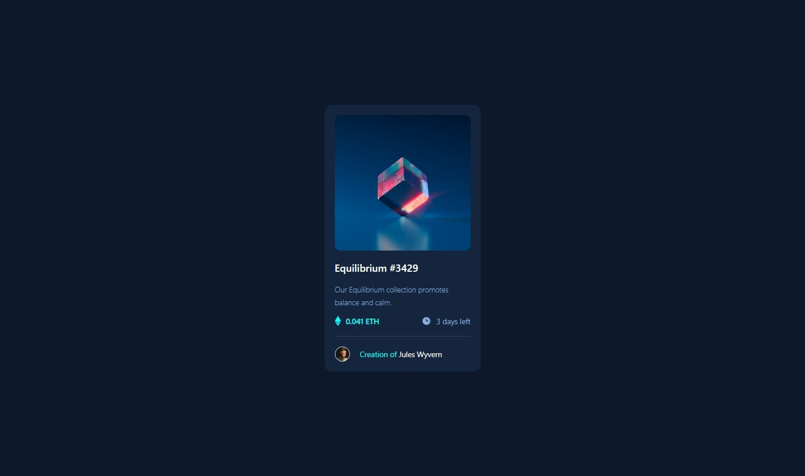

# Frontend Mentor - NFT Preview Card solution

This is a solution to the [NFT Preview Card challenge on Frontend Mentor](https://www.frontendmentor.io/challenges/nft-preview-card-component-SbdUL_w0U). [Frontend Mentor](https://www.frontendmentor.io) challenges help you improve your coding skills by building realistic projects. 

## Table of contents

- [Overview](#overview)
  - [Screenshot](#screenshot)
  - [Links](#links)
- [Process](#process)
  - [Built with](#built-with)
  - [Thoughts](#thoughts)
  - [Useful resources](#useful-resources)
- [Author](#author)

## Overview

### Screenshot

|  |
|:--:|
|Mobile Screenshot|

|  |
|:--:|
|Desktop Screenshot|

### Links

- Solution URL: [QR Code Solution](https://github.com/clakr/frontend-mentor/tree/main/nft-preview-card)
- Live Site URL: [https://clakr.github.io/frontend-mentor/nft-preview-card/](https://clakr.github.io/frontend-mentor/nft-preview-card/)

## Process

### Built with

- HTML5
- CSS
  - Grid
  - Flexbox
- TailwindCSS
  - extends
  - plugins
  - `group` & `group-active:`

### Thoughts

Not much into thoughts of designing the component itself, but the "how" of extending the existing color palette of TailwindCSS through the `tailwind.config.js`, `extends`, and `plugins` is what I want to learn for this project.

If I were to improve this solution, it would be through creating of pseudo elements instead of creating another element for the active state of the image.

### Useful resources

- [TailwindCSS](https://tailwindcss.com/) - `tailwind.config.js`, `extends` & `plugins`

## Author

- Curriculum Vitae / Résumé - [Clark Tolosa](https://clakr.vercel.app)
- Frontend Mentor - [@clakr](https://www.frontendmentor.io/profile/clakr)
