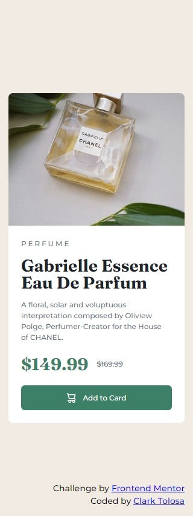

# Frontend Mentor - Product Preview Card solution

This is a solution to the [Product Preview Card challenge on Frontend Mentor](https://www.frontendmentor.io/challenges/product-preview-card-component-GO7UmttRfa). Frontend Mentor challenges help you improve your coding skills by building realistic projects. 

## Table of contents

- [Overview](#overview)
  - [Screenshot](#screenshot)
  - [Links](#links)
- [Process](#process)
  - [Built with](#built-with)
  - [Thoughts](#thoughts)
  - [Useful resources](#useful-resources)
- [Author](#author)

## Overview

### Screenshot

|  |
|:--:|
|Mobile Screenshot|

|  |
|:--:|
|Desktop Screenshot|

### Links

- Solution URL: [Product Preview Card Solution](https://github.com/clakr/frontend-mentor/tree/main/product-preview-card-component-main)
- Live Site URL: [https://clakr.github.io/frontend-mentor/product-preview-card-component/](https://clakr.github.io/frontend-mentor/product-preview-card-component/)

## Process

### Built with

- HTML5
- CSS
  - `normalize.css`
  - Grid
  - Flexbox
  - Pseudo-class selectors
  - Variables
  - Media Queries
- SASS
  - Variables
  - `@mixin` & `@include` 
  - Media Queries

### Thoughts

Just like what I did in my [last solution](https://clakr.github.io/frontend-mentor/qr-code-component-main/), I started from using Mobile-first principle and work the component up, adjusting elements according to the design. Since Media Queries played a big role in this challenge, I integrated [SASS](https://sass-lang.com/) into the project just to feel out how easy SASS' syntax is in writing CSS.

### Useful resources

- [`normalize.css`](https://www.joshwcomeau.com/css/custom-css-reset/) - CSS Reset
- [SASS](https://sass-lang.com/) - CSS Nesting Syntax

## Author

- Curriculum Vitae / Résumé - [Clark Tolosa](https://clakr.vercel.app)
- Frontend Mentor - [@clakr](https://www.frontendmentor.io/profile/clakr)

