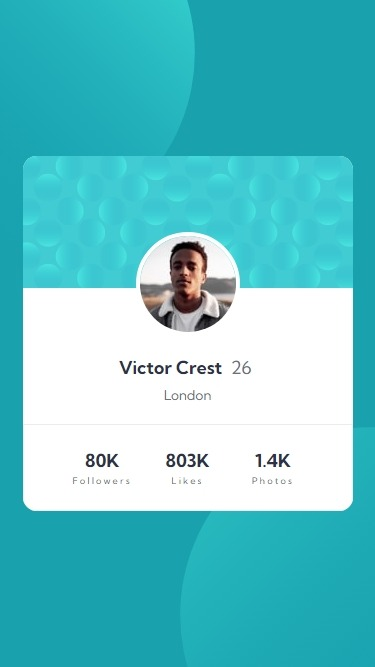
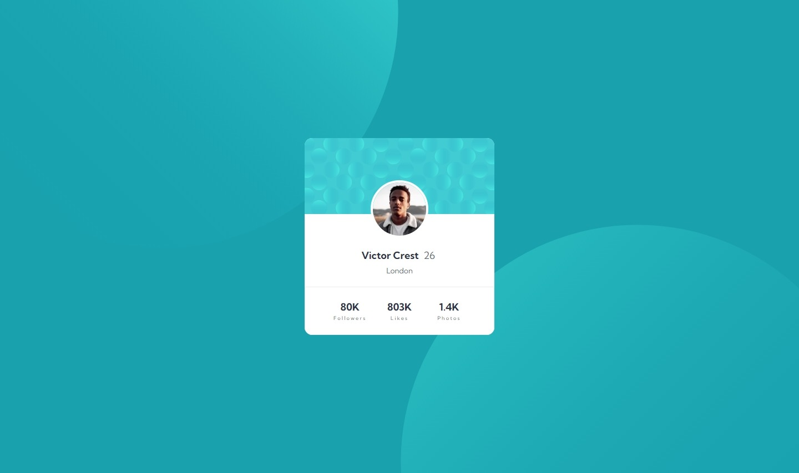

# Frontend Mentor - Profile Card solution

This is a solution to the [Profile Card challenge on Frontend Mentor](https://www.frontendmentor.io/challenges/profile-card-component-cfArpWshJ). Frontend Mentor challenges help you improve your coding skills by building realistic projects. 

## Table of contents

- [Overview](#overview)
  - [Screenshot](#screenshot)
  - [Links](#links)
- [Process](#process)
  - [Built with](#built-with)
  - [Thoughts](#thoughts)
  - [Useful resources](#useful-resources)
- [Author](#author)

## Overview

### Screenshot

|  |
|:--:|
|Mobile Screenshot|

|  |
|:--:|
|Desktop Screenshot|

### Links

- Solution URL: [Profile Card Solution](https://github.com/clakr/frontend-mentor/tree/main/profile-card)
- Live Site URL: [https://clakr.github.io/frontend-mentor/profile-card/](https://clakr.github.io/frontend-mentor/profile-card/)

## Process

### Built with

- HTML5
- CSS
  - `normalize.css`
  - `display: flex` & `display: grid`
  - Variables

### Thoughts

Not much complexity layout-wise, as the card's layout is the same from mobile to desktop media queries.

Just had trouble with how the `background-image` size is scaling up in size therefore intersecting, which I think is not intended. Currently looking into `min()`, `max()`, `minmax()` & `clamp()`.

### Useful resources

- [`normalize.css`](https://www.joshwcomeau.com/css/custom-css-reset/) - CSS Reset

## Author

- Curriculum Vitae / Résumé - [Clark Tolosa](https://clakr.vercel.app)
- Frontend Mentor - [@clakr](https://www.frontendmentor.io/profile/clakr)