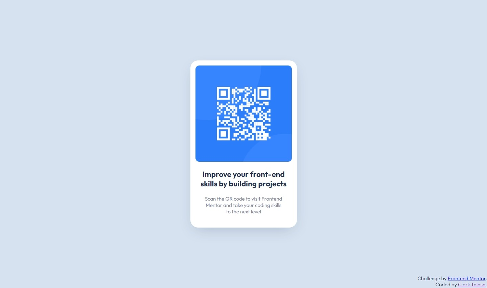

# Frontend Mentor - QR Code solution

This is a solution to the [QR Code challenge on Frontend Mentor](https://www.frontendmentor.io/challenges/qr-code-component-iux_sIO_H). [Frontend Mentor](https://www.frontendmentor.io) challenges help you improve your coding skills by building realistic projects. 

## Table of contents

- [Overview](#overview)
  - [Screenshot](#screenshot)
  - [Links](#links)
- [Process](#process)
  - [Built with](#built-with)
  - [Thoughts](#thoughts)
  - [Useful resources](#useful-resources)
- [Author](#author)

## Overview

### Screenshot

|  |
|:--:|
|Mobile Screenshot|

|  |
|:--:|
|Desktop Screenshot|

### Links

- Solution URL: [QR Code Solution](https://github.com/clakr/frontend-mentor/tree/main/qr-code)
- Live Site URL: [https://clakr.github.io/frontend-mentor/qr-code/](https://clakr.github.io/frontend-mentor/qr-code/)

## Process

### Built with

- HTML5
- CSS
  - `normalize.css`
  - Grid
  - Flexbox
  - Pseudo-class selectors
  - Variables

### Thoughts

Mobile-first principle fits into this challenge easily since you can start with the viewport of 375px first, and adjust components accordingly. In this case though I'm quite satisfied with how the card looks in mobile so I just went with it and set the card's `max-width` & `max-height` to the computed properties found in DevTools.

If I were to improve my solution this challenge, it would be with the image element. It's possible to recreate the design of the [QR Code](./images/image-qr-code.png) with pseudo elements instead of implementing the design on the image itself. 

Also I don't know the exact values of the `box-shadow` property of the card so I just copied the utility class of [TailwindCSS' `shadow-2xl`](https://tailwindcss.com/docs/box-shadow) and just replaced the color with the `darkBlue` color referenced in `style-guide.md`.

### Useful resources

- [`normalize.css`](https://www.joshwcomeau.com/css/custom-css-reset/) - CSS Reset
- [TailwindCSS](https://tailwindcss.com/) - Mobile-first principle and utility classes

## Author

- Curriculum Vitae / Résumé - [Clark Tolosa](https://clakr.vercel.app)
- Frontend Mentor - [@clakr](https://www.frontendmentor.io/profile/clakr)

