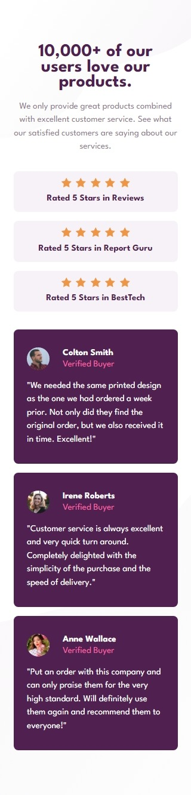
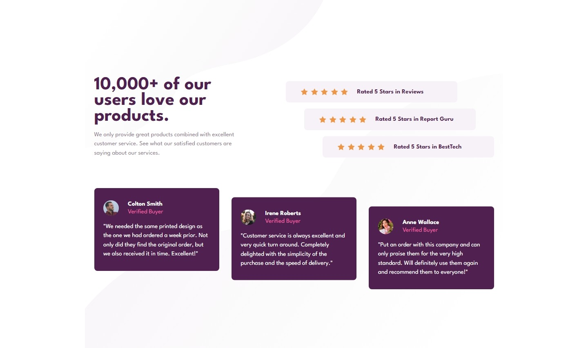

# Frontend Mentor - Social Proof Section solution

This is a solution to the [Social Proof Section challenge on Frontend Mentor](https://www.frontendmentor.io/challenges/social-proof-section-6e0qTv_bA). Frontend Mentor challenges help you improve your coding skills by building realistic projects. 

## Table of contents

- [Overview](#overview)
  - [Screenshot](#screenshot)
  - [Links](#links)
- [Process](#process)
  - [Built with](#built-with)
  - [Thoughts](#thoughts)
  - [Useful resources](#useful-resources)
- [Author](#author)

## Overview

### Screenshot

|  |
|:--:|
|Mobile Screenshot|

|  |
|:--:|
|Desktop Screenshot|

### Links

- Solution URL: [Social Proof Section Solution](https://github.com/clakr/frontend-mentor/tree/main/social-proof-section)
- Live Site URL: [https://clakr.github.io/frontend-mentor/social-proof-section/](https://clakr.github.io/frontend-mentor/social-proof-section/)

## Process

### Built with

- HTML5
- CSS
  - `normalize.css`
  - Pseudo-class selectors
  - `tranform: ` property
- SASS
  - `display: flex` & `display: grid`
  - `@mixin`, `@include`
  - Media Queries
  - Variables

### Thoughts

Not much thoughts into this one all-in-all, I just think that desktop's layout is much more complicated than the mobile's since mobile's layout is kinda just like stacking elements, you just need to group elements that are relevant to each other. e.g. ratings, user cards, etc.

I just think that if I'm doing something repeatedly, I'm thinking of doing React with `.map()` method, this way it's more maintainable by having a single source of truth and iterating that source of truth. Or maybe I'm just lazy, that too. 

Anyways, good exercise, introduces `transform: ` property with `:nth-child(n)` to select specific property to add specific values. 

### Useful resources

- [`normalize.css`](https://www.joshwcomeau.com/css/custom-css-reset/) - CSS Reset

## Author

- Curriculum Vitae / Résumé - [Clark Tolosa](https://clakr.vercel.app)
- Frontend Mentor - [@clakr](https://www.frontendmentor.io/profile/clakr)