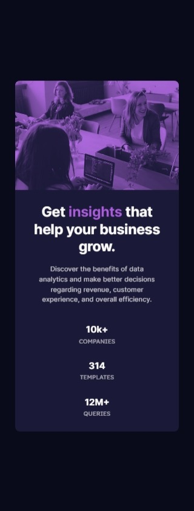

# Frontend Mentor - Stats Preview Card solution

This is a solution to the [Stats Preview Card challenge on Frontend Mentor](https://www.frontendmentor.io/challenges/stats-preview-card-component-8JqbgoU62). Frontend Mentor challenges help you improve your coding skills by building realistic projects. 

## Table of contents

- [Overview](#overview)
  - [Screenshot](#screenshot)
  - [Links](#links)
- [Process](#process)
  - [Built with](#built-with)
  - [Thoughts](#thoughts)
  - [Useful resources](#useful-resources)
- [Author](#author)

## Overview

### Screenshot

|  |
|:--:|
|Mobile Screenshot|

|  |
|:--:|
|Desktop Screenshot|

### Links

- Solution URL: [Stats Preview Card Solution](https://github.com/clakr/frontend-mentor/tree/main/stats-preview-card)
- Live Site URL: [https://clakr.github.io/frontend-mentor/stats-preview-card/](https://clakr.github.io/frontend-mentor/stats-preview-card/)

## Process

### Built with

- HTML5
- CSS
  - `normalize.css`
  - `display: flex` & `display: grid`
  - Pseudo-class selectors
  - Variables

### Thoughts

Not much complexity in the layout, you just need to be wary of the order when the screen gets bigger, for this use `display: grid` on the parent with `order: ` for the child you're targeting, in this case, it's `div` with the class `card__header`.

The challenge is the light violet filter(?) on the image. I've tried the following approaches: 
 ```css
.card__header {
  filter: hue-rotate();
}
```
It takes a lot of time doing a trial-and-error in finding a degree that matches with the design
```css
.card__header::after {
  height: inherit;
  width: inherit;
  background-color: var(--softViolet);
  opacity: 25%;
  /* opacity: 50%; */
  /* opacity: 75%; */
}
```
Same problem with the former approach, trying to tinker what `opacity: ` value fits best with color from the design.
```css
.card__header {
  position: relative;
  mix-blend-mode: screen;
}

.card__header::after {
  content: "";
  height: inherit;
  width: inherit;
  background-color: var(--softViolet);
  position: absolute;
  mix-blend-mode: multiply;
}
``` 
My best bet would prolly this approach, as this _closely_ match with the design, with the design's filter color's slightly lighter color than what I came up with. This is also takes a lot of time, trying to figure out what `mix-blend-mode: ` value is appropriate to come up with a match.

So if anyone has better solution with this problem, open an issue, pull request, discussion, or whatever you prefer. I also tried asking for help in Frontend Mentor's Slack Community but, as I'm writing this, nothing yet, because of _timezones_. 

I've also tried doing [BEM Conventions](https://getbem.com/introduction/), **HOWEVER**, I've not yet done any research about this, so everything I've put out in my CSS are all ground-level knowledge from what I've seen from others doing these. I learn better in this way, that's why.

Based on short experience, it's much better using BEM in targeting elements instead of using pseudo selectors, since if you want changes, you can just find the class itself easily, since the main characteristics of this convention as readable and maintainable.

### Useful resources

- [`normalize.css`](https://www.joshwcomeau.com/css/custom-css-reset/) - CSS Reset
- [BEM](https://getbem.com/introduction/) - Conventions


## Author

- Curriculum Vitae / Résumé - [Clark Tolosa](https://clakr.vercel.app)
- Frontend Mentor - [@clakr](https://www.frontendmentor.io/profile/clakr)